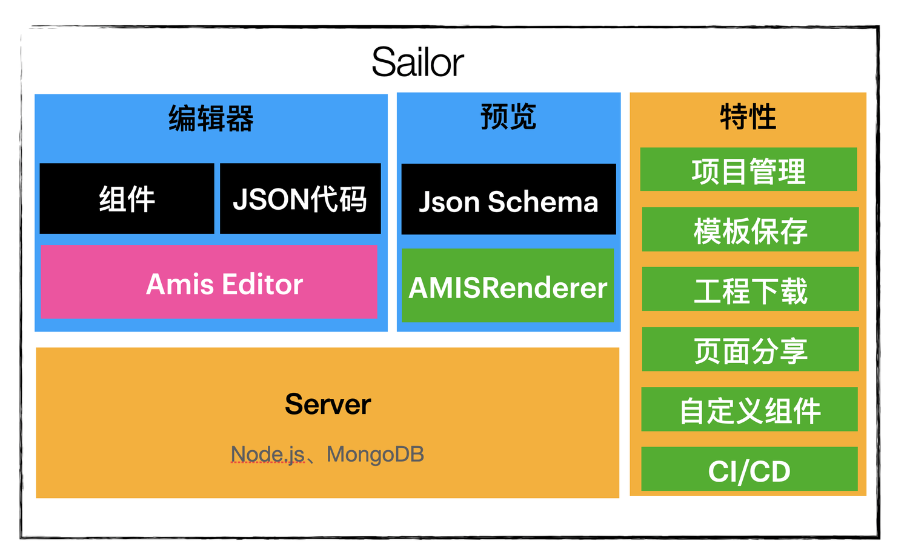

# Sailor

水手低码平台（Sailor Low-Code Platform），在线体验：http://sailor.bighome360.com/ ，账号密码：guest/123456

基于 [amis-editor-demo](http://aisuda.github.io/amis-editor-demo) 改造

技术栈：

-   服务端：Koa + MongoDB
-   前端：React + Amis

## 本地运行
> 注意：需要使用 `Node14` 版本，`Node13` 及以下版本不支持；

1. 根目录 `npm i` 安装依赖
2. `cd sailor-server` 进入服务端目录

-   `npm i` 安装服务端依赖
-   将根目录文件`package.json`的`scripts.dev`的`MONGODB_USER`和`MONGODB_PASSWORD`修改为为本地mongodb的用户名和密码（db sailor）
-   `npm run dev` 开发启动

4. 根目录 `npm run dev` 编译前端
5. 根目录 `npm run client:start` 启动前端，http://localhost:8082/

## TODO List

### V1.0

-   [x] 用户登录
-   [x] 项目列表
-   [x] 项目新增、删除、查询
-   [x] 项目编辑
-   [x] 新增页面、删除页面
-   [x] 页面预览
-   [x] amis-editor 编辑后保存页面
-   [x] 项目下载
-   [x] 下载的项目本地运行正常

issues：

-   [ ] 页面重命名
-   [ ] 项目重命名
-   [ ] 页面缓存清除（保存退出、删除之后）

## 使用协议

MIT
